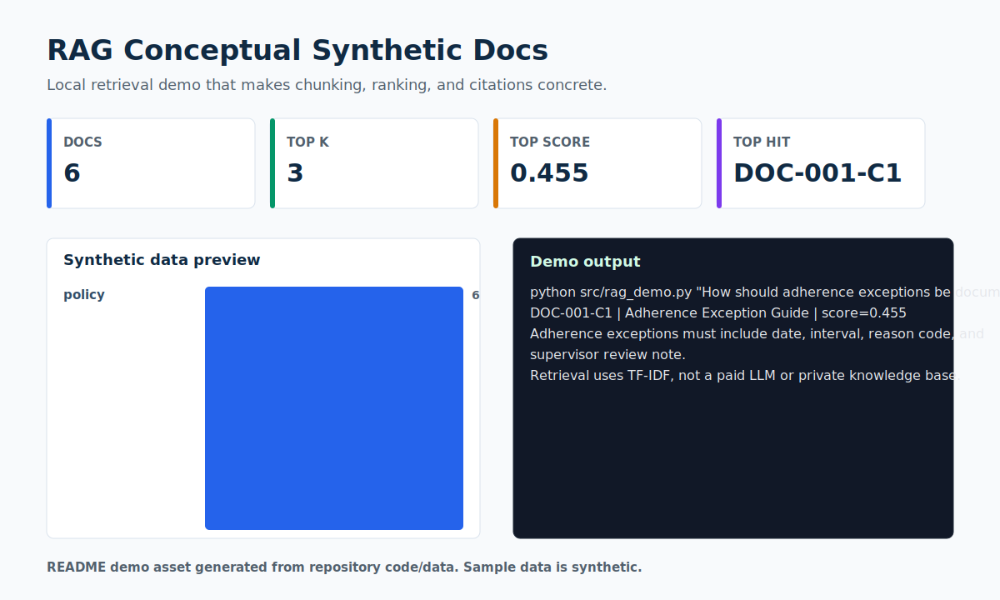

# RAG Conceptual Synthetic Docs

> A local RAG concept demo with synthetic documents, chunking, retrieval, and citations.



## Recruiter Snapshot

| 30-second question | Answer |
| --- | --- |
| Problem | RAG can sound abstract; a small local demo helps recruiters see that I understand retrieval steps before production complexity. |
| My role | I created synthetic policy-style documents, chunked them, implemented TF-IDF retrieval, and returned ranked chunks with citations. |
| Result | For the adherence exception query, the demo retrieves `DOC-001-C1` as the top chunk with score 0.455. |
| Portfolio signal | Shows practical AI literacy: chunking, retrieval ranking, citation discipline, and clear scope limits. |
| Data policy | All records are synthetic and safe for a public portfolio. |

## What I Built

- Synthetic mini knowledge base for operations policies.
- Sentence-level chunking with chunk IDs.
- TF-IDF similarity search returning top-k cited chunks.

## Evidence In This Repo

- `src/rag_demo.py` runs the retrieval demo.
- `ARCHITECTURE.md` explains the conceptual RAG flow.
- `data/sample_synthetic_data.csv` contains the synthetic source documents.

## Tools And Concepts

`RAG`, `TF-IDF`, `scikit-learn`, `chunking`, `retrieval`, `citations`, `Python`

## Run Locally

```bash
python -m venv .venv
.venv\Scripts\activate
python -m pip install -r requirements.txt
python src/rag_demo.py "How should adherence exceptions be documented?"
```

## Limitations

This is a conceptual local retrieval demo, not a production RAG service. It uses synthetic documents and TF-IDF rather than a hosted vector database.

## Next Iteration

- Add evaluation queries with expected source chunks.
- Add embeddings as an optional retrieval backend.
- Add answer synthesis with citations while keeping source text visible.

## Data Privacy

Every record, identifier, organization, person, scenario, and result in this project is synthetic unless explicitly marked otherwise. No employer, client, university, colleague, customer, credential, private path, or sensitive personal record is used.
